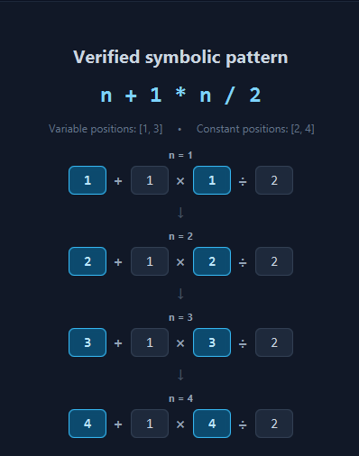

# Equation Matcher

[](https://github.com/ShaiBeekman/Equation-Matcher/releases/latest)

[](LICENSE)
[](https://github.com/ShaiBeekman/Equation-Matcher/releases/download/v1.1.1/Equation-Matcher-v1.1.1-windows.zip)

**A symbolic formula discovery engine built in Java.**

Equation Matcher searches through numerical expressions, identifies expressions that match a target sequence, and tracks how their terms must change across successive inputs. From those substitution patterns, it attempts to reconstruct a symbolic formula in terms of `n`.

Rather than starting with a formula and calculating its values, Equation Matcher approaches the problem in reverse: **given the values, can a formula be discovered?**


## Download

**Equation Matcher v1.0.0** is available as a standalone Windows application.

Download the latest Windows installer from the **[Releases](../../releases/latest)** page.

No separate Java installation is required.

## How It Works

Equation Matcher performs formula discovery as a four-phase search.

### Phase 1 — Expression Generation

The engine generates candidate expressions across every permitted combination of:

- numerical terms
- addition (`+`)
- subtraction (`-`)
- multiplication (`*`)
- division (`/`)
- exponentiation (`^`)

Operator patterns and numerical combinations are systematically explored to construct the initial expression space.

### Phase 2 — Sequence Matching

Each generated expression is evaluated against the values of the selected sequence.

Expressions that produce the required value are retained as candidates for that input. Expressions that do not match are discarded from further consideration.

### Phase 3 — Substitution Search

This is where Equation Matcher begins looking for structure rather than isolated numerical coincidences.

For each surviving expression, the engine explores possible term substitutions as the sequence advances from one input to the next. Each valid substitution creates a path that records **which positions changed and how they changed**.

A path survives only when the resulting expression continues to equal the required sequence value.


The search runs on a background thread while the interface reports the active phase, progress, and number of surviving substitution paths.

### Phase 4 — Symbolic Formula Discovery

Once a substitution path survives across the verification range, Equation Matcher analyzes its history.

Positions that consistently advance with the sequence input can be identified as variables, while unchanged positions remain constants. The numerical expression can then be transformed into a candidate symbolic formula.

## From Numerical Expressions to Variables

For example, Equation Matcher may discover the following surviving path:

```text
n = 1     1 + 1 × 1 ÷ 2
n = 2     2 + 1 × 2 ÷ 2
n = 3     3 + 1 × 3 ÷ 2
n = 4     4 + 1 × 4 ÷ 2
```

The first and third positions change consistently with the input while the second and fourth remain constant.

Equation Matcher therefore identifies:

```text
Variable positions: [1, 3]
Constant positions: [2, 4]
```

and reconstructs the symbolic expression:

```text
n + 1 × n ÷ 2
```



The interface exposes this substitution history so that a discovered formula is not presented as a black-box result: the numerical path that produced it can be inspected directly.

## Search Statistics

Equation Matcher tracks the search as it runs, including:

- expressions searched
- operator patterns explored
- surviving substitution paths
- formulas discovered

Depending on the configured expression length, a single search can evaluate millions of candidate expressions before arriving at its surviving symbolic patterns.

## Features

- Exhaustive numerical expression generation
- Multiple operator permutations
- Combinatorial term substitution
- Substitution-history tracking
- Duplicate-state elimination
- Symbolic variable detection
- Formula deduplication
- Configurable verification range
- Configurable maximum expression length
- Summandial (Gaussian sum) and factorial sequence modes
- Four-phase live search progress
- Interactive formula verification paths
- Background computation with a responsive JavaFX interface

## Built With

- **Java** — search engine and application logic
- **JavaFX** — desktop user interface
- **CSS** — interface styling
- **Maven** — dependency and build management

## Project Structure

```text
src/
└── main/
    ├── java/
    │   └── equationmatcher/
    │       ├── algorithm/
    │       │   └── EquationMatcherEngine.java
    │       ├── gui/
    │       │   └── MainView.java
    │       ├── model/
    │       │   ├── FormulaResult.java
    │       │   ├── GeneratedExpression.java
    │       │   └── SubstitutionState.java
    │       └── MainApp.java
    │
    └── resources/
        └── equationmatcher/
            └── styles.css
```

The application separates the search algorithm, data models, and JavaFX presentation layer so that the formula-discovery engine remains independent of the interface.

## Running Equation Matcher

### Requirements

- Java
- Maven

Clone the repository:

```bash
git clone <repository-url>
cd EquationMatcher
```

Run the application with Maven:

```bash
mvn javafx:run
```

## Current Scope

Equation Matcher currently searches expressions constructed from numerical terms and the operators `+`, `-`, `*`, `/`, and `^`.

The current implementation focuses on the summandial sequence (the cumulative sums 1+2+⋯+n, commonly associated with the Gaussian sum) and the factorial sequence.

A discovered formula should therefore be understood as a formula **verified across the configured search range**, rather than a mathematical proof that the identity holds for every possible value of `n`.

## Why I Built It

Equation Matcher began with a question about the factorial sequence.

I wanted to investigate whether a closed-form expression for factorial values
could be discovered computationally by searching through arithmetic expressions
and tracking how successful expressions change as the input increases.

Before applying that idea to factorials, I needed a sequence with a known
closed form as a proof of concept. I chose the summandial sequence,

    1, 3, 6, 10, 15, ...

whose values are the cumulative sums

    1
    1 + 2
    1 + 2 + 3
    1 + 2 + 3 + 4
    ...

and whose familiar closed form is

    n(n + 1) / 2

(often associated with the Gaussian sum).

If Equation Matcher could begin with only the numerical sequence and recover
expressions equivalent to this known formula, that would provide a test of
the underlying search and substitution approach.

The program successfully discovers multiple representations of the summandial
formula by identifying which numerical positions consistently change with the
input and converting those positions into symbolic variables.

Factorial remains the more difficult target. Its much faster growth produces
a substantially larger and more demanding search problem, so practical
computational limits currently restrict how far that search can be explored.

The summandial therefore serves both as a proof of concept for the algorithm
and as a controlled example of how Equation Matcher can move from numerical
behavior toward symbolic structure.
